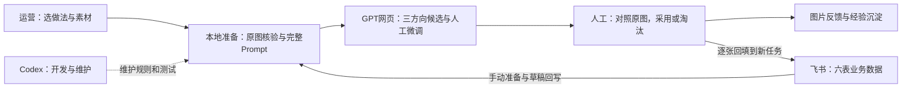
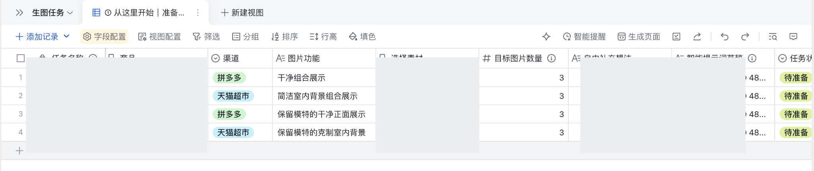
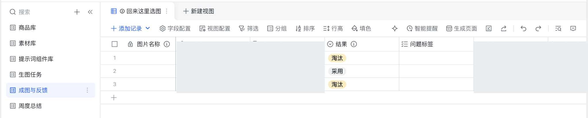

# Image Factory V2

**让电商运营更容易做对商品图，同时保留创意自主权。**

真实素材约束 · 三种可读做法 · 本地生成准备包 · GPT网页创作 · 图片级人工反馈

这个项目来自一次产品纠偏：V1先建设了自动化流水线、审核与恢复，真实试产却暴露出商品失真、场景融合差和使用门槛高的问题。V2保留素材核验与可靠性经验，把日常创作交给运营和GPT网页，把Codex放回开发维护的位置。

> 工程链路跑通，不等于图片值得交付。先验证创作方法，再扩大自动化。

## 当前能做什么

| 已实现并验证 | 尚未完成或证明 |
|---|---|
| 六表、64字段的数据骨架；26个可复用组件 | 原生事件自动触发与后台监听 |
| 三个常用做法：商品看清楚、穿搭换环境、版式有设计感 | 更多商品、更多轮次的效果稳定性 |
| 原图字节/来源校验、完整Prompt、三方向与任务定位的本地包 | 多人长期使用、规模化生产稳定性 |
| 手动新建/复制飞书任务，按自由想法回写草稿，准备真实原图包并逐图关联反馈 | 转化率改善或显著人力、成本节省 |
| 30项离线测试（原18项＋接通12项）；失败写入先对账、不自动重发 | 自动周度总结与AI推荐实验 |

本地已有两款批准素材的准备能力。**公开仓不附带业务原图、生成图、真实飞书资源或内部回执**，测试使用独立合成数据。

**P0 两款商品已完成首轮人工真实生图验证，并获得明确采用/淘汰反馈。** 鞋采用C方向，茄克采用B方向；本轮没有明显丢失商品结构、原有标记或主体。此结果不代表转化提升、生产上线或大规模稳定。

## 一次任务怎么走



运营选择完整做法并补一句想法，不需要逐条挑十几个底层组件。商品身份、颜色、可见结构、原标记和当前素材边界始终保留；背景、版式与阅读层次可以设计。

三张候选用于**比较方向**，不是生成近似副本。选定方向之后，才考虑统一套图。Prompt保护不能保证模型保真，最终采用前仍要逐张对照原图。

## 两个日常入口

**准备生图：取得真实原图与可复制Prompt。**



**回来选图：每张图独立反馈，未评价时留空。**



截图来自已存在的飞书视图，用于说明运营界面；它们不代表新任务自动准备已经完成。当前飞书最小链路由本地入口手动运行：新任务真实ID、草稿回写、实际原图与Prompt包、图片附件及反馈关联已验收；没有后台自动触发。

## 本地验证

Python 3.10及以上。安装依赖后，公开仓可独立运行测试，无需飞书登录、业务素材或模型密钥：

```bash
python3 -m venv .venv
source .venv/bin/activate
python -m pip install -r requirements.txt
python -m unittest discover -s tests -v
```

在已有批准素材与现有飞书登录的本机，日常可双击`飞书准备与回填.command`，或运行：

```bash
python scripts/connect_feishu.py interactive
```

修改飞书想法后，选择“按当前想法准备新包”。Prompt真正使用后才确认快照；回填时选择对应包版本，每图一条。详细命令见[使用流程](docs/使用流程.md)。原来的纯本地准备仍保留：

```bash
python scripts/prepare_p0.py --interactive
```

macOS也可双击根目录的 `准备新包.command`。新包写到 `out/p0/自备包/`，已有包不覆盖。准备脚本只操作本地文件，不生图、不读取环境密钥、不调用模型或飞书API。公开克隆缺少私有批准清单时会明确停止，不以URL或演示图冒充业务素材。

配置与使用边界见[使用流程](docs/使用流程.md)。

## 从真实试错得到什么

- 组合商品原图适合二维目录与背景测试，不能证明新鞋底、后跟或穿着角度。
- 早期轮次候选差异过小，且有结果丢失原有标记：保护词写了，仍然需要人工验收。
- 服装背景应服务服装；更多环境元素不自动带来更好的商业展示。
- 六表数据模型成立，仍要把日常入口收敛到“准备”和“选图”。

案例图因公开权利未确认而不上传。完整事实与用户提供的方向判断，分别说明在[案例复盘](docs/案例复盘.md)；没有把方向建议写成已验证的商业收益。

## V1 → V2：验证顺序的纠偏

V1的问题不在于Runtime、Runner、审核和恢复本身没有价值，而在于创作方法尚未证明前，就提前投入了这些复杂能力。自动化只能放大已经有效的方法。

V1把Codex放进必经的日常生图链后，实际产出不理想。这受到Prompt路线、素材事实、流程约束和早期硬合成路线共同影响，不能简单归为模型能力结论。在本项目的业务体量和试验条件下，Codex更适合开发、维护、迁移与校验，运营用GPT网页进行连续创作和审美判断。

详细复盘见[经验与教训](docs/经验与教训.md)。

## 导航

| 想了解 | 入口 |
|---|---|
| 当前完成到哪里 | [STATUS](docs/STATUS.md) |
| 代码与文档怎么找 | [MAP](MAP.md) |
| 普通运营如何使用 | [使用流程](docs/使用流程.md) |
| 六表关系与关键决定 | [领域模型](docs/domain/DOMAIN-MODEL.md)、[ADR](docs/adr/README.md) |
| 产品取舍与事实边界 | [设计与边界](docs/设计与边界.md)、[案例复盘](docs/案例复盘.md) |
| 资料积累与许可 | [知识索引](docs/长期积累/电商生图/00_索引.md)、[第三方来源](docs/第三方来源.md) |
| 公开安全 | [公开边界](docs/公开边界.md)、[发布检查](docs/PUBLIC-RELEASE-CHECK.md) |

## 来源与许可

方法研究借鉴了[buluslan](https://github.com/buluslan/gpt-image2-ecommerce)、[yang0](https://github.com/yang0/handraw-style)和[JeremyGDM](https://github.com/JeremyGDM/awesome-ai-product-photography-prompts)。保留固定来源、作者署名与第三方许可；没有整套安装或运行上游生图系统。

本仓用于作品集与MVP展示。除明确标注的第三方内容外，**未授予统一开源许可**；可见源代码不等于无限使用授权。
