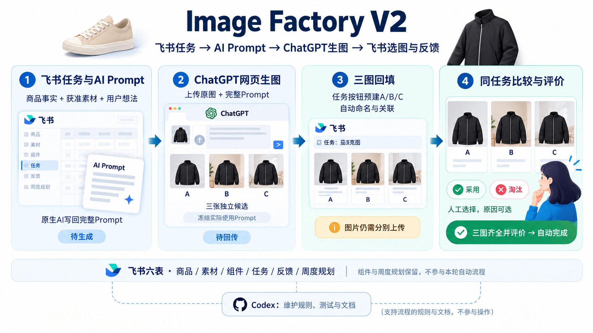

# Image Factory V2

**面向真实电商运营的成熟商品视觉内容生产流程。**

运营在飞书填写商品、渠道、图片用途和创意想法；飞书生成完整中文 Prompt，ChatGPT 网页基于已批准原图生成独立候选，再回到飞书集中比较、人工选图并沉淀反馈。

> **已投入真实运营场景并完成端到端使用验证。** 两款真实商品共生成并回填六张独立候选，均关联到正确任务并由使用者本人评价。三图预建、同任务集中比较和评价齐全后自动完成任务，也已通过独立安全测试任务验收。

## 完整业务流程



图中商品为通用示意插画，流程取自实际验收的飞书与 ChatGPT 操作。业务原图、生成图和私有飞书记录不进入公开仓库。

飞书的原生工作流读取商品、已批准素材和任务想法，生成完整 Prompt 并写回任务。运营在 ChatGPT 网页中上传原图、使用完整 Prompt，生成三张彼此独立的候选；随后把实际使用的 Prompt 存入最终提示词快照。

回到飞书后，任务上的“三图回填”按钮会建立三条已命名并关联当前任务的反馈记录。运营上传 A/B/C 三张图片，在同一画册中比较并逐张选择“采用”或“淘汰”。三张都有图片和人工评价后，任务自动完成。

## 真实运营验证

| 商品 | 真实使用结果 |
|---|---|
| 488726 休闲鞋 | 三张独立候选回填并由用户评价；C 采用，A/B 淘汰。商品结构与已知标记基本保留，没有乱补未知鞋底或后跟。 |
| 484330 牛仔风格茄克 | 三张独立候选回填并由用户评价；B 采用，A/C 淘汰。衣服和模特主体基本保持。 |

两个真实任务均保存了实际使用的 Prompt 快照、关联了对应候选并完成评价。三图按钮和自动完成路径使用独立安全测试记录验证，既有真实任务和历史反馈保持原样。

33 项现有回归测试持续通过。验证记录和项目当前状态见[状态说明](docs/STATUS.md)。

## 运营如何使用

1. 在飞书“生图任务”选择商品、渠道、图片功能和已批准素材，补充创意想法；图片功能为“商品看清楚 / 穿搭换环境 / 版式有设计感”。
2. 任务进入“待准备”后，飞书自动生成完整中文 Prompt 并将任务置为“待生成”。运营不需要理解或挑选底层提示词组件。
3. 打开所选素材的原图，在 ChatGPT 网页新建对话并粘贴 Prompt，要求生成三张独立图片，每个方向一张，不拼图、不分栏。
4. 检查候选与原图的一致性，把实际使用的 Prompt 保存为最终快照，再将任务改为“待回传”。
5. 点击“三图回填”里的“建立ABC反馈”，在同任务画册上传三张候选并逐张填写人工评价；三张评价齐全后任务自动完成。

详细入口见[运营使用速记](docs/运营使用速记.md)、[使用流程](docs/使用流程.md)和[完整使用与原理手册](docs/完整使用与原理手册.md)。

## 运营边界

- 商品事实来自商品库和当前选择的已批准素材；禁改项优先于创意要求。
- 创意变化来自场景、版式、构图、光线、色彩和视觉语言。不得改变商品颜色或标记，也不得猜测素材没有展示的鞋底、后跟、内部、穿着角度、材质、性能或参数。
- AI 生成结果由运营逐张检查，采用或淘汰始终由人决定。
- 当前回填入口自动创建并关联三条记录；三张图片仍需逐张上传，运营在画册里逐张打开并评价。
- 图片处理只使用已批准原图。真实业务原图、生成图、飞书记录坐标、内部回执和密钥不会上传到公开仓库。

## 项目结构与维护

正式运营入口是飞书和 ChatGPT 网页。历史 Python 能力保留为 **legacy / validation only**，用于维护、回归和历史数据校验，不作为运营操作入口。

公开测试使用独立合成数据，无需业务图片、飞书身份或模型密钥：

```bash
python3 -m venv .venv
source .venv/bin/activate
python -m pip install -r requirements.txt
python -m unittest discover -s tests -v
```

| 想了解 | 入口 |
|---|---|
| 项目状态与验收证据 | [STATUS](docs/STATUS.md) |
| 代码、文档与流程入口 | [MAP](MAP.md) |
| 普通运营使用说明 | [运营使用速记](docs/运营使用速记.md)、[使用流程](docs/使用流程.md) |
| 完整操作、字段与设计原理 | [完整使用与原理手册](docs/完整使用与原理手册.md) |
| 六表关系与关键设计决定 | [领域模型](docs/domain/DOMAIN-MODEL.md)、[ADR](docs/adr/README.md) |
| 设计边界与真实案例 | [设计与边界](docs/设计与边界.md)、[案例复盘](docs/案例复盘.md) |
| AI 能力验证记录 | [飞书 AI 小实验](docs/飞书AI小实验.md) |
| 长期资料与来源许可 | [知识索引](docs/长期积累/电商生图/00_索引.md)、[第三方来源](docs/第三方来源.md) |
| 公开内容与发布要求 | [公开边界](docs/公开边界.md)、[发布检查](docs/PUBLIC-RELEASE-CHECK.md) |

项目方法参考了[buluslan](https://github.com/buluslan/gpt-image2-ecommerce)、[yang0](https://github.com/yang0/handraw-style)和[JeremyGDM](https://github.com/JeremyGDM/awesome-ai-product-photography-prompts)，保留来源、作者署名和第三方许可。项目仓库没有统一开源许可；可见源代码不代表无限使用授权。
